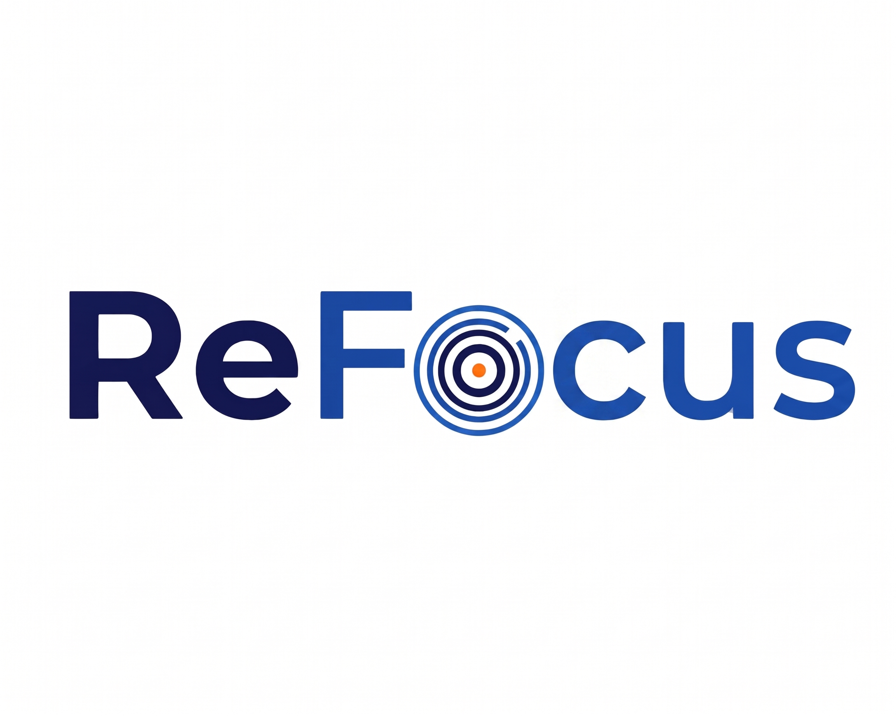
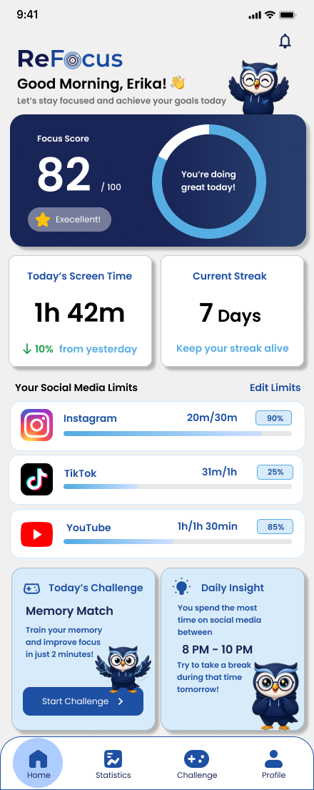
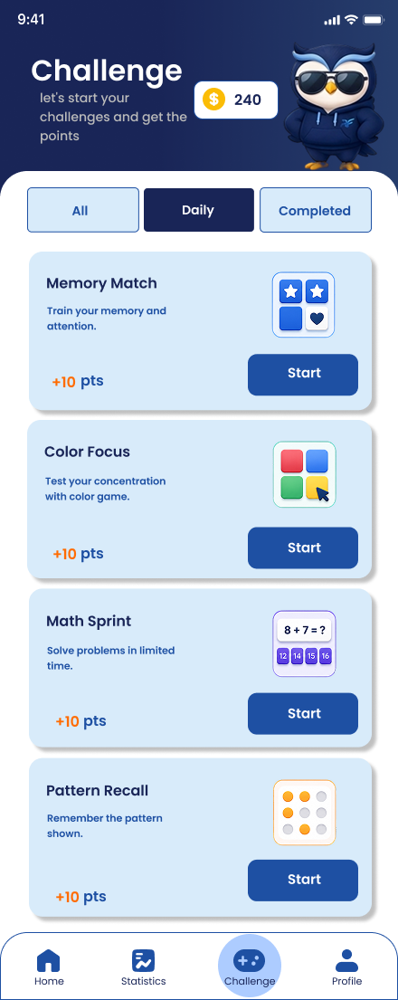

# 📱 ReFocus

<div align="center">



### Reclaim Your Focus, Live Better.

**Mobile Application for Reducing Social Media Distraction Through Focus Lock and Educational Challenges.**


</div>

---

# 📖 About

ReFocus is a mobile application developed as a university project to help students reduce social media distractions while studying.

Unlike traditional screen time applications, ReFocus temporarily locks selected social media applications after reaching a predefined usage limit. During the lock period, users are encouraged to complete educational mini games designed to help regain concentration before returning to study.

The application combines **digital wellbeing**, **gamification**, and **focus management** into one integrated mobile experience.

---

# 🎯 Objectives

- Reduce excessive social media usage
- Improve students' concentration while studying
- Encourage healthier digital habits
- Increase productivity through gamification
- Support Sustainable Development Goals (SDGs)

---

# 🌍 Sustainable Development Goals (SDGs)

ReFocus supports:

## SDG 3
**Good Health and Well-being**

Helping users maintain better mental well-being by reducing excessive digital distraction.

## SDG 4
**Quality Education**

Improving learning effectiveness through better focus and reduced procrastination.

## SDG 9
**Industry, Innovation and Infrastructure**

Applying mobile technology to solve everyday educational challenges through innovative digital solutions.

---

# ✨ Features

- 🔐 Social Media App Lock
- ⏱ Focus Session Timer
- 📊 Screen Time Statistics
- 🧠 Educational Mini Games
- 🔥 Daily Focus Streak
- 🏆 Achievement & Badge
- 📈 Weekly & Monthly Reports
- 🎯 Daily Focus Goal
- 🔔 Smart Notification Reminder
- 👤 User Profile

---

# 🧩 Mini Games

- 🧠 Memory Match
- 🎨 Color Focus
- ➕ Math Sprint
- 🧩 Pattern Recall
- ⚡ Reaction Tap

---

# 📱 Screens

- Introduction
- Login
- Sign Up
- Home Dashboard
- Statistics
- Challenge
- Focus Session
- Profile
- Settings

---

# 🏗 System Architecture

```
User
   │
   ▼
Flutter Mobile App
   │
   ├── Authentication
   ├── Focus Engine
   ├── App Usage Monitor
   ├── Challenge Module
   ├── Statistics Module
   │
   ▼
Backend API
   │
   ▼
Database
```

---

# 🛠 Tech Stack

| Category | Technology |
|-----------|------------|
| Framework | Flutter |
| Language | Dart |
| UI Design | Figma |
| Version Control | Git & GitHub |
| Database | SQLite / Firebase |
| Backend | REST API |

---

# 📂 Project Structure

```
refocus/

├── assets/
│
├── lib/
│   ├── core/
│   ├── features/
│   │   ├── introduction/
│   │   ├── authentication/
│   │   ├── home/
│   │   ├── statistics/
│   │   ├── challenge/
│   │   ├── profile/
│   │   └── settings/
│   │
│   ├── shared/
│   └── main.dart
│
├── docs/
│   └── ui-ux/
│
└── README.md
```

---

# 🎨 UI/UX Documentation

The complete UX process includes:

- UX Problem Framing
- UX Research Plan
- Field Observation
- Interview Results
- Research Findings
- User Persona
- Information Architecture
- User Flow
- Wireframe
- Design System
- High Fidelity Prototype

---

# 👨‍💻 Team

| Member | Role |
|----------|------|
| Erika Ayu Febrianti | UI/UX Designer |
| Dio Lutvi Andre | Frontend Developer |
| Sofa Chasani Wibisono | Backend & Database Developer |

---

# 📊 Research Summary

The application was developed based on:

- Observation of **28 university students**
- Interview with **6 active social media users**

### Main Findings

- Most students use social media **2–6 hours/day**
- Social media is frequently accessed while studying
- Notifications and boredom are the biggest distraction triggers
- Existing focus applications are considered easy to bypass
- Users prefer strict app locking combined with gamification

---

# 🚀 Future Development

- AI-based focus recommendation
- Personalized challenge difficulty
- Cross-device synchronization
- Cloud backup
- Smart productivity analytics
- Pomodoro integration
- Community focus leaderboard

---

# 📸 Preview

| Home | Statistics | Challenge |
|------|------------|-----------|
| ** | ** | ** |


---

# 🔗 Project Resources

## 📂 Documentation

| Resource | Link |
|----------|------|
| 📄 Project Report | https://drive.google.com/drive/u/0/folders/1uwWlT8dPO2zyu7LdKUGf5TkN4HuQWsLX |
| 🎨 Figma Design | https://www.figma.com/design/pYjE06a4WALc36vWhO5IFT/ReFocus_TEKMOB?node-id=0-1&p=f&t=bNNfkVHOFJzBw8a4-0 |
| 💻 GitHub Repository | https://github.com/Refocus-Team/ReFocus/tree/main |
| 📑 Poster (A1) | https://drive.google.com/file/d/1BsdGMQ05h-y6HfRzSxTetMxSBWjKltRl/view?usp=sharing |


---

## 📥 Google Drive

The complete project documentation, including reports, posters, presentation slides, UI/UX documentation, and other supporting files can be accessed here:

🔗 **https://drive.google.com/drive/u/0/folders/1uwWlT8dPO2zyu7LdKUGf5TkN4HuQWsLX**

---

## 🎨 Figma

Explore the complete UI/UX design, design system, prototype, and user flow:

🔗 **https://www.figma.com/design/pYjE06a4WALc36vWhO5IFT/ReFocus_TEKMOB?node-id=0-1&p=f&t=bNNfkVHOFJzBw8a4-0**

---

## 💻 Repository

Source code is available on GitHub:

🔗 **https://github.com/Refocus-Team/ReFocus/tree/main**

🔗 **https://github.com/Refocus-Team/ReFocus/tree/finalapps**

---

# 📄 License

This project was developed for educational purposes as part of the Mobile Application Development course at Universitas Ahmad Dahlan.

---

<div align="center">

### ⭐ ReFocus

**Focus Better, Live Better.**

Made with ❤️ using Flutter

</div>